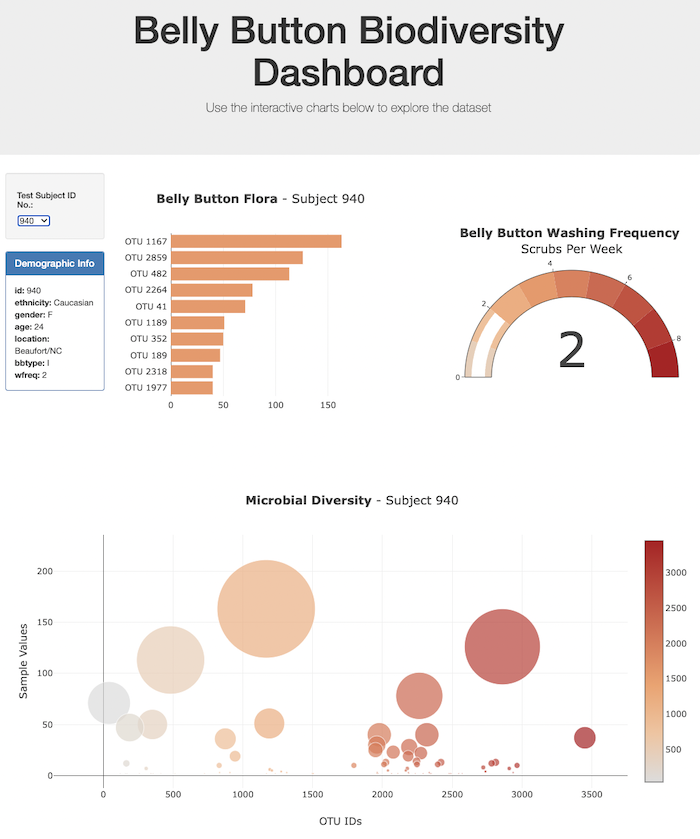

# Belly Button Challenge

Create interactive charts of Belly Button Microbe data using JavaScript, D3 and Plotly!

Created and submitted for an assignment for Monash University Data Analytics Boot Camp (September 2023).

## Table of Contents

- [General info](#general-info)
- [Technologies](#technologies)
- [Screenshot](#screenshot)
- [Code example](#code-example)
- [References](#references)

## General info

### app.js

- Loads JSON data from external website. 
- Accesses HTML code to store data as Objects and Arrays for visualisation.
- Implements Dropdown Menu to select a specific Subject ID.  
- Visualises Data for that Subject ID:
  - Horizontal Bar Chart of Top 10 Microbes
  - Bubble Chart of Microbial Diversity
  - BONUS: Gauge Chart of Belly Button Wash Frequency


### index.html

- Interactive Dashboard of Belly Button Data.

### samples.json

- Raw data in JSON format.

### bonus.js

- Empty JavaScript file (required for index.html to open correctly).


## Technologies

Project created and run using:

- JavaScript 116.0.0.0
- Plotly 5.9.0
- Visual Studio Code 1.79.2

## Screenshot

#### Belly Button Biodiversity Dashboard



## Code example

```javascript
// Code Snippet from app.js
////////////////////////////////////////////////////////////// 

////////// FETCH JSON DATA & PLOT INTERACTIVE CHARTS /////////
//////////////////////////////////////////////////////////////
d3.json(url).then(function(data) {
    
  // Check Data in Console
  console.log("Data: ", data);
    
    // Assign required data to variables
    let names = data.names;
    let samples = data.samples;
    let metadata = data.metadata;
    
    // Make Object of Metadata for Easy Access
    let metadataObject = metadata.map(metadatum =>({
        'id': metadatum.id,
        'ethnicity': metadatum.ethnicity,
        'gender': metadatum.gender,
        'age': metadatum.age,
        'location': metadatum.location,
        'bbtype': metadatum.bbtype,
        'wfreq': metadatum.wfreq
    }));
    
    // Check metadata
    console.log('Metadata: ', metadataObject);

    // Make Object of Sample Data for Easy Access
    let sample_object = samples.map(sample => ({
        'id': sample.id,
        'otu_ids': sample.otu_ids,
        'values': sample.sample_values,
        'labels': sample.otu_labels
    }));
    
    // Check Sample Object
    console.log("Data Object: ", sample_object);
    
    // Check first ID
    console.log('First ID: ', sample_object[0].id)
    
    // Check all IDs
    console.log('All IDs: ', names)

    // Call Dropdown Menu Function
    makeMenu()

    // User selection
    d3.selectAll("#selDataset").on("change", getData);
```

## References

- Populating Dropdown Menu with Sample IDs:
  - AskBCS Learning Assistant (code adapted with modifications)
  - ```javascript
    ////////////// FUNCTION: Populate Dropdown Menu //////////////
    //////////////////////////////////////////////////////////////
    function makeMenu(){
            
        // Get reference to the Dropdown select element
        let dropdownMenu = d3.select("#selDataset");
          
        // Use the Array of Sample Names to populate the menu options
        let sampleIDs = names;
          
        // Append ID Array to Dropdown Menu
        sampleIDs.forEach((id) => {
        dropdownMenu
          .append("option")
          .text(id)
          .property("value", id);
    })};
  
- Plotly Bubble Chart:
  
  - https://plotly.com/javascript/bubble-charts/
  
- Plotly Gauge Chart:
  
  - https://plotly.com/javascript/gauge-charts/
  
- Raw JSON Data Link: 

  - https://2u-data-curriculum-team.s3.amazonaws.com/dataviz-classroom/v1.1/14-Interactive-Web-Visualizations/02-Homework/samples.json

- Code, in general, was adapted from Monash University Data Analytics Boot Camp 2023 course learning material.

Created and written by Samuel Palframan - September 2023.
